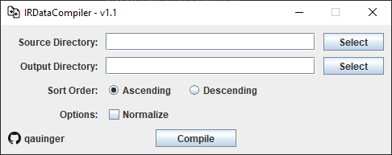

# ir-data-compiler
This program is used to combine data point table `.dpt` files exported from Bruker OPUS spectroscopy software into one compiled file containing all of the data.

For example, files *A*, *B*, and *C*, will be compiled into a single *Compiled File*.
|           **File A**          |           **File B**          |           **File C**          |    | **Compiled File**                                     |
|:-----------------------------:|:-----------------------------:|:-----------------------------:|----|-------------------------------------------------------|
| 1.4,0.1 2.5,0.3 4.2,0.7 | 1.4,0.2 2.5,0.4 4.2,0.9 | 1.4,0.5 2.5,0.8 4.2,1.3 | -> | 1.4,0.1,0.2,0.5 2.5,0.3,0.4,0.8 4.2,0.7,0.9,1.3 |

